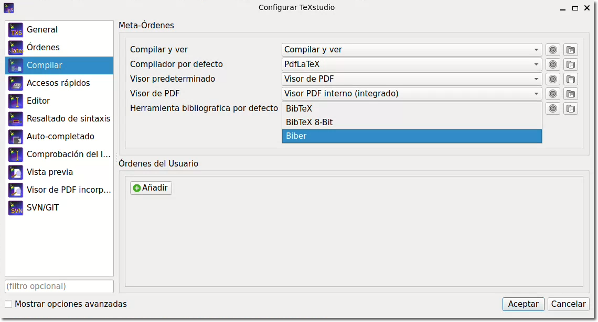

# Este tutorial te ayudará a utilizar la plantilla de anteproyecto de tesis en formato LaTeX que utilizamos en la Maestría/Doctorado en Ciencias de la Computación.

#### <strong>Descarga:</strong> [plantilla_protocolo2.zip]({{ site.baseurl }}) &nbsp; ｜ &nbsp;  <strong>Ejemplo:</strong> [Protocolo2.pdf]({{ site.baseurl }}){:target="_blank"}

---

 

La nueva plantilla para la redacción de tu protocolo (<mark class="archivo">Protocolo.tex</mark>) se basa en los [Lineamientos para la elaboración de la tesis de licenciatura, especialidad, maestría y doctorado](https://gacetajuchiman.ujat.mx/wp-content/uploads/2024/03/anexo-108.pdf){:target="_blank"} de la UJAT, los cuales a su vez siguen la norma APA en su versión 7: <https://normas-apa.org>.

## 1.  Preámbulo

Todos los paquetes que se importan dentro del preámbulo del documento son esenciales excepto:

~~~latex
% Números de línea para facilitar la revisión
\usepackage{lineno}
~~~

Este paquete sirve para numerar cada línea del documento y así facilitar su revisión. En caso de que quieras eliminar estas guías deberás remover esta instrucción y también eliminar el comando `\linenumbers` dentro del cuerpo del documento.

En el documento encontrarás varios paquetes comentados. LaTeX cuenta con cientos (miles) de paquetes para multitud de usos, pero te sugerimos utilizar los que te proponemos. Simplemente descomentalos y listo.

La configuración global del documento de acuerdo con el formato APA es:

~~~latex
\usepackage{helvet}
\renewcommand{\familydefault}{\sfdefault}
\usepackage[doublespacing]{setspace}
\usepackage{indentfirst}
\usepackage{csquotes}
\usepackage{geometry}
\geometry{
	top=2.54cm,
	left=2.54cm,
	right=2.54cm,
	bottom=2.54cm
}
~~~

Aquí establecemos los márgenes, tipografía, sangría y el doble espacio entre líneas.

## 2.  Datos del proyecto

Hemos creado una serie de comandos para definir los elementos que aparecerán en la portada de tu protocolo. Los nombres de los comandos son muy descriptivos, simplemente reemplaza el texto de ejemplo por tu información. Por ejemplo:

- `\newcommand{\Titulo}{}` sirve para definir el título de tu tesis.
- `\newcommand{\Autor}{}` aquí va tu nombre completo.
- `\newcommand{\Director}{}` El nombre de tu director(a) de tesis.
- etcétera.

Importante:

* En caso de que no tengas codirector entonces deberán editar el archivo (<mark class="archivo">Caratula.tex</mark>) y eliminar esta sección (en ambas páginas):

~~~latex
\vspace{1cm}
EN CODIRECCIÓN:
{\large\bfseries\MakeUppercase\Codirector}
~~~

* Si tienes más de 3 revisores en tu tesis (los cuales se convierten en vocales durante tu examen profesional) entonces deberás agregar nuevos profesores en la sección correspondiente con `{\large\bfseries\MakeUppercase\RevisorD}\\`, `{\large\bfseries\MakeUppercase\RevisorE}\\` y así sucesivamente. 
Luego en el archivo principal crear el nuevo comando:

~~~latex
\newcommand{\RevisorD}{Dra. Cristina López Ramírez}
\newcommand{\RevisorE}{Dr. José Adán Hernández Nolasco}
% Y así sucesivamente
~~~

* Cuidar el género: Maestro/Maestra, Dr./Dra., Director/Directora.

## 3.  Referencias

El formato de referencias sigue el estándar APA. Para poder formatear nuestras referencias usando este estándar es necesario importar el paquete BibLaTeX e importar inmediatamente su archivo de referencias:

~~~latex
\usepackage[style=apa,backend=biber]{biblatex}
\addbibresource{Referencias.bib}
~~~

El archivo <mark class="archivo">Referencias.bib</mark> incluirá todas la bibliografía consultada.

Sé cuidadoso al agregar nuevas entradas a tu archivo archivo de referencias, ya que <code>biber</code> es muy sensible a los errores de sintaxis.

## 4.  Imágenes

Finalmente, en el directorio <mark class="archivo">/img</mark> van a colocar las imagénes que incluirá su documento. La instrucción `\graphicspath` le indica a LaTeX que todas las imágenes estarán en este directorio, así que al momento de incluir una figura simplemente escribimos el nombre del archivo sin necesidad de especificar el directorio que la contiene:

~~~latex
  \includegraphics[width=0.7\textwidth]{ia}
~~~

## 5.  Documento principal

El cuerpo del documento contiene todas las secciones necesarias de tu anteproyecto de tesis. Los elementos  en color azul son comentarios que deberás eliminar en la versión final.

Para citar tienes 2 opciones:

**Cita narrativa**. Es conocida como cita basada en el autor porque se incluye al comienzo de una frase. El nombre del autor se incorpora al texto como parte de la oración y el año sigue entre paréntesis. Ejemplo:

> García-López et al., (2023) developed a software called JMetaBFOP...

La cual en LaTeX quedaría: `\cite{softwarex2023} developed a software called JMetaBFOP \dots`.

**Cita parentética**. En este caso el nombre del autor y la fecha de publicación aparecen entre paréntesis y generalmente se colocan al final de la oración. Ejemplo:

> JMetaBFOP is a tool for solving global optimization problems (García-López et al., 2023)

Para ello hemos creado el comando `\newcommand{\citep}[1]{(\cite{#1})}` para encerrar la cita textual entre paréntesis. Utilizálo como un `\cite` normal: `JMetaBFOP is a tool for solving global optimization problems \citep(softwarex2023)`.

En este caso la referencia es:

~~~bibtex
@article{softwarex2023,
  author = {García-López, Adrian and Chávez-Bosquez, Oscar and Hernández-Torruco, José and Hernández-Ocaña, Betania},
  title  = {JMetaBFOP: A tool for solving global optimization problems},
  journal= {SoftwareX},
  volume = {23},
  year   = {2023},
  doi    = {10.1016/j.softx.2023.101452} 
}
~~~

## 6.  Configuración del Entorno de Desarrollo

Una desventaja de usar el formato APA para las referencias es que es incompatible con BibTeX, el estándar de LaTeX para el manejo de referencias. Entonces tenemos que usar <code>biber</code>, que es un paquete adicional que deberán instalar en su equipo.

Otro detalle surge al momento de compilar en cualquier IDE, ya que por default intentará compilar las referencias usando BibTeX. Deberás configurar tu IDE para que las referencias las compile con biber en lugar de BibTeX de acuerdo a las instrucciones mostradas en https://texwelt.de/fragen/1909/wie-verwende-ich-biber-in-meinem-editor (la página está en Alemán pero las imágenes son muy descriptivas).

En caso que utilices TeXstudio, el cual es el IDE que vimos en el taller de LaTeX, debes cambiar la siguiente configuración:

## 7.  Formato Doctorado

Si eres estudiante de DCC entonces te corresponde cambiar el color de fondo de la portada y el grado a obtener. Esto se hace modificando el archivo <mark class="archivo">Caratula.tex</mark>:

~~~latex
    \raisebox{-\height}{\includegraphics[width=\paperwidth]{base_morena}}%
~~~

Y en el archivo principal:

~~~latex
\newcommand{\Grado}{Doctorado en Ciencias de la Computación}
~~~

 

¡Listo! Ya tienes todo lo necesario para comenzar a escribir tu anteproyecto sin distracciones.